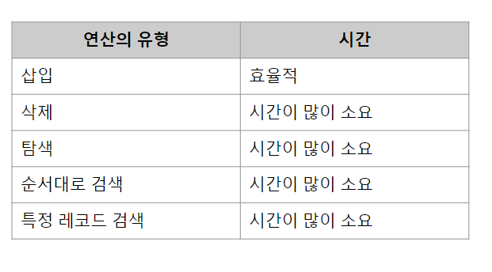
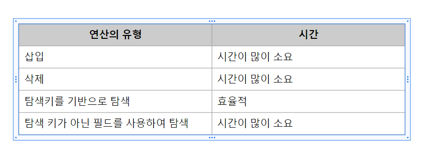

ORACLE을 기반으로 하는 데이터베이스 배움터 (개정 3판)

# CHAPTER 6 물리적 데이터베이스 설계 
- 질의를 효율적으로 지원하기 위해서 인덱스 구조를 적절히 사용. `너무 많은 인덱스를 정의하면 데이터베이스 갱신 시 시간이 많이 걸리니 적절하게 인덱스 설계 필요하다.`
- 데이터는 디스크와 같은 보조 기억 장치에 저장된다.
- DBMS는 운영 체제와 상호 작용을 하면서 디스크로부터 데이터를 읽어온다. 

# 보조 기억 장치 
- 데이터를 검색하기 위해 DBMS는 디스크상의 데이터베이스로부터 사용자가 원하는 데이터를 포함하고 있는 블록(페이지)을 읽어 RAM으로 가져온다. 데이터가 변경되면 블록을 디스크에 다시 기록해야한다. 
  + 주기억장치(RAM)은 CPU와 접근이 매우 빠르지만 휘발성이다. 
- 디스크는 여러 개의 판으로 이루어졌고, 각 판은 트랙과 섹터로 구분된다. 한 트랙의 용량이 매우 크기 떄문에 섹터로 구분한다. 
- 디스크에서 임의의 블록을 읽어오거나 기록하는 데 걸리는 시간은 탐구시간, 회전 지연시간, 전송시간의 합이다. 
  + 탐구시간: 실린더 위에 디스크 헤드가 놓을 때까지 걸리는 시간 
  + 회전지연시간: 디스크 헤드가 원하는 블록에 올 때까지 걸리는 시간 
  + 전송시간: 블록을 주기억 장치로 전송하는 데 걸리는 시간 
- `디스크접근에 소요되는 시간을 감소시키기 위해서는 평균 회전 지연 시간을 줄이고, 블록 전송 횟수를 감소시켜야 한다.` 
- DBMS는 임의 접근보다 `순차 접근`을 이용해 성능 향상을 시킨다. 그러기 위해서는 연관된 데이터들이 인접하게 저장되어야 한다.  
- DBMS가 여러 블록을 읽어 RAM으로 올릴 때 항상 그 블록들이 디스크 상에 인접해 있지 않으므로 여러 번의 입출력이 발생할 수 있다. 이 때문에 성능이 저하가 발생되므로 디스크 입출력 횟수를 줄이는 게 DBMS의 성능을 높이는 방법이다. 

# 버퍼와 운영 체제
- 디스크 입출력은 컴퓨터 시스템에서 가장 속도가 느린 작업이므로 `입출력 횟수를 줄이는 것이 DBMS의 성능을 향상시키는데 매우 중요하다.` 가능하면 많은 블록들을 주기억 장치에 유지(버퍼)하거나 자주 참조되는 블록들을 주기억 장치에 유지하면 블록 전송 횟수를 줄일 수 있다. 

# 디스크상에서 화일의 레코드 배치 
- 여러 레코드(row)들이 한 블록에 들어간다. 레코드 길이가 블록 크기를 초과하면 두 개 이상의 블록에 걸쳐서 저장한다. 
- 빈번하게 조회되는 레코드들을 블록에 넣을 때 입출력을 최소화하기 위해서 하나의 질의에서 함께 요구될 정보를 동일한 블록에 넣는 클러스터링을 쓸 수 있다. 즉, 연관된 데이터를 같은 블록에 저장하여 데이터를 읽을 때 이 블록만 읽으면 되도록 한데 묶는 클러스터링 기법을 사용할 수 있다.
  + 화일(테이블) 내의 클러스터링: (화일 내 레코드들을 다른 블록에 저장해도 되지만,) 한 화일 내에 같이 검색될 가능성이 높은 레코드를 함께 저장하는 기법 
    + 사원 테이블 내에서 같은 부서끼리 같은 블록에 저장하기 
  + 화일 간의 클러스터링: 빈번하게 조인이 수행되는 레코드들을 가까운 곳에 저장. 화일 간의 조인 성능은 향상시키지만 화일 전체를 탐색하는 연산, 삽입 연산, 수정 연산의 속도는 저하된다. 

# 화일 조직
## 히프 화일(비순서 화일)
- 레코드들이 삽입된 순서대로 화일의 가장 끝에 저장된다. 삽입이 쉽지만 탐색 하기 위해서는 순차적으로 접근해야 하므로 시간이 오래걸린다. 삭제한 후 이 공간을 재사용하려면 빈자리를 찾아야 하므로 삽입 시간이 증가하고 레코드들의 순서는 없다. 즉, 삽입은 빠르지만, 순서가 보장되지 않기 때문에, 전체 탐색에는 빠르고 특정 탐색에는 느리다. 

- 데이터를 한꺼번에 적재할 때, 릴레이션에 몇 개의 블록들만 있을 때, 검색 위주로 사용될 때 주로 사용된다. 

## 순차 화일(순서 화일)
- 레코드들이 레코드의 하나 이상의 필드 값(`탐색키`)의 순서에 따라 `정렬`되어 저장된다. 순차 화일은 레코드들을 순차 접근하는 응용에 적합하다. 정렬되어 있기 때문에 특정 레코드를 검색하는 경우 이진 탐색을 이용할 수 있다. 레코드의 순서를 고려해야 하기 때문에 삽입 연산은 느리다. 블록에 삽입할 공간이 없는 경우 오버플로 블록에 넣거나 재조직 해야하므로 느리다. 

# 단일 단계 인덱스
- `<탐색키, 레코드에 대한 포인터>`로 이루어진다.
- 엔트리들은 `탐색 키 값의 오름차순으로 정렬`된다. 인덱스는 DBMS가 화일 내의 특정 레코드들을 `이진 탐색`을 이용하여 빠르게 찾을 수 있도록 하는 데이터 구조이다. 인덱스를 통해 질의하면 응답 시간이 향상된다. 인덱스는 별도의 공간에 저장된다. 
- `인덱스 전체를 주기억 장치에 유지할 수 있을 때 인덱스가 성능에 도움이 된다.`

## 기본 인덱스(primary index)
- `탐색 키`가 `기본 키`인 인덱스를 기본 인덱스라 한다. 기본 인덱스는 `기본 키로 정렬`되어 있다. 
- 각 테이블마다 최대 `한 개`의 기본 인덱스를 가질 수 있다.  
- `인덱스 엔트리들의 정렬 순서와 데이터 화일의 레코드들의 정렬 순서가 일치`하면 `클러스터링 인덱스`이다.

## 보조 인덱스(secondary index)
- 보조 인덱스의 엔트리는 탐색 키로 정렬되어 있지만, 데이터는 인덱스가 정의된 필드의 값과 무관하게 저장되어 있다.(non clustering)
- 기본 인덱스를 사용한 순차 접근은 효율적이지만 보조 인덱스를 사용한 순차 접근은 비효율적이다. 

## 희소 인덱스(sparse idnex)
- 희소 인덱스는 각 `블록`마다 한 개의 탐색 키 값이 인덱스 엔트리에 포함된다. 
- 주로 기본키가 희소 인덱스로 유지된다.

## 밀집 인덱스(dense index)
- 밀집 인덱스는 각 `레코드`의 탐색 키 값이 인덱스 엔트리에 포함된다. 
- 주로 보조 인덱스가 밀집 인덱스로 유지된다.

# 다단계 인덱스 
- 인덱스 자체가 클 경우 엔트리를 탐색하는 시간을 줄이기 위해서 단일 단계 인텍스를 디스크 상의 하나의 순서 화일로 간주하고, 단일 단계 인덱스에 대해서 다시 인덱스를 정의할 수 있다. 1단계 인덱슨느 밀집 인덱스 또는 희소 인덱스 모두 가능하지만 2단계 이상의 인덱스는 희소 인덱스만 가능하다.
- 가장 상위 단계 인덱스는 주기억 장치에 상주할 수 있다. 다단계 인덱스에 새로운 인덱스 엔트리를 추가하거나 삭제하면 단일 단계 인덱스보다 처리 과정이 복잡해진다. 하지만 데이터 베이스는 갱신보다 검색 비율이 높으므로 모든 DBMS에서는 다단계 인덱스로 유지한다. 
- 대부분의 다단계 인덱스는 B+-트리를 사용한다. B+-트리의 각 노드는 다수의 자식 노드들을 가진다. 
- 복합 컬럼에 인덱스를 정의할 떄 컬럼의 순서가 중요하다. 컬럼의 개수를 3개 이내로 사용하는 게 좋다.
- `인덱스는 검색 속도를 향상시키지만 인덱스를 저장하기 위한 공간이 추가로 필요하고 삽입, 삭제, 수정 연산의 속도는 저하된다.` 

## 인덱스 결정 지침 
- 카디널리티가 거의 전체 레코드 수와 비슷하고, 그 컬럼이 동등 조건에 사용된다면 비클러스터링(보조) 인덱스를 생성하는 것이 좋다.
- 데이터가 많은 테이블에서 검색 하려는 결과(2%~4%)가 적다면 인덱스를 생성하는 것이 좋다. 
- insert, delete, update가 빈번한 테이블에는 인덱스를 피해야 한다.
- 후보키는 기본 키가 갖는 모든 특성을 갖기 때문에 인덱스를 생성할 후보가 된다. 
- 가능하면 정수형 컬럼에 인덱스를 만들고, 그 다음에는 고정 길이의 컬럼에 인덱스를 만드는 게 좋다.
- 가변형(VARCHAR) 데이터 타입을 갖는 컬럼에 인덱스 만드는 것을 피해야 한다. 또한 날짜형, 실수형 컬럼에는 인덱스를 만들지 않아야 한다. 
- 대량의 데이터를 삽입할 때는 모든 인덱스를 제거하고, 데이터 삽입이 끝난 후에 인덱스들을 다시 생성하는 것이 좋다. 
- 정렬 속도를 향상시키기 위해서 ORDER BY절에 자주 사용되는 컬럼, GROUP BY절에 자주 사용되는 컬럼은 인덱스 후보이다. 

## 인덱스가 사용되지 않는 경우 
- 테이블의 크기가 작은 경우
- 인덱스에 산술 연산자가 사용된 경우 인덱스가 사용되지 않는다.
  + ex) salary * 12 > 400000 -> salary > 400000/12
- 널값을 사용하는 경우 
  + ex) salary IS NULL
- LIKE 사용시 '%'가 먼저 나오는 경우 
  + ex) NAME LIKE '%김' -> NAME LIKE '김%'

# CHAPTER 9 트랜잭션 
- `트랜잭션은 데이터베이스 응용에서 하나의 논리적인 단위를 수행하는 데이터베이스 연산들의 모임이다.` 
- 다수의 프로그램들을 동시에 수행하듯이 여러 트랜잭션들을 동시에 수행해야 한다. 동시에 수행되는 트랜잭션들이 데이터 베이스에 미치는 영향은 이들을 순차적으로 수행하였을 때 데이터베이스에 미치는 영향과 같도록 보장해야 한다. (동시성 제어)
- 기본적으로 각각의 SQL문이 하나의 트랜잭션으로 취급된다. 따라서 두 개 이상의 SQL문들들 하나의 트랜잭션으로 취급하려면 사용자가 이를 명시적으로 표시해야 한다. 

## 트랜잭션의 특징 (ACID)
### 원자성(Atomicity)
- 원자성은 한 트랜잭션 내의 모든 연산들이 완전히 수행되거나 전혀 수행되지 않음을 의미한다. 즉, `한 트랜잭션의 모든 연산이 데이터베이스에 완전히 반영되거나 전혀 반영되지 않아야 한다.` 
### 일관성(Consistency)
- 한 트랜잭션을 정확하게 수행하고 나면 데이터베이스가 하나의 일관된 상태에서 다른 일관된 상태로 바뀐다.
### 고립성(Isolation)
- 한 트랜잭션이 데이터를 갱신하는 동안 이 트랜잭션이 완료되기 전에는 갱신 중인 데이터를 다른 트랜잭션들이 접근하지 못하도록 해야한다.
### 지속성(Durability)
- 트랜잭션 결과는 스시템에 고장이 발생하더라도 손실되지 않는다.

# 동시성 제어
- DBMS의 성능을 높이기 위해 여러 사용자의 질의나 프로그램들을 동시에 수행하는 것이 필수적이다. 
- DBMS가 아무런 조치를 하지 않고 트랜잭션을 동시에 수행시키면 여러 문제가 발생하므로 동시성을 제어해야 한다.
  + 갱신 손실, dirty read, unrepeatable read 문제 발생 
- 동시성 제어 기법은 여러 사용자들이 다수의 트랜잭션들을 동시에 수행하는 환경에서 부정확한 결과를 생성할 수 있는, 트랜잭션들 간의 간섭이 생기지 않도록 한다. 

# 로크 
- 동일한 데이터 항목에 대한 여러 트랜잭션들의 동시 접근을 조정하기 위해서 로크(lock)가 사용된다.
- 트랜잭션에서 `갱신`을 목적으로 데이터 항목을 접근할 때는 `독점 로크(쓰기 잠금)`를 요청한다.
- 트랜잭션에서 `읽을 목적`으로 데이터 항목을 접근할 때는 `공유 로크(읽기 잠금)`를 요청한다.
- 공유 로크는 다른 트랜잭션도 읽을 수 있다. 공유 로크에 독점 로크를 요청하거나 독점 로크에 독점 로크나 공유 로크를 요청하는 경우 대기한다.
- 적은 수의 로우를 접근하는 트랜잭션에 대해서는 투플을 로크 단위로 하고, 한 테이블에 속하는 대부분의 로우들을 접근하는 트랜잭션에 대해서는 테이블을 로크 단위로 하는 것이 바람직하다.

# 고립 수준
## READ UNCOMMITTED (레벨0)
- `읽기 잠금을 걸지 않기` 때문에, 트랜잭션이 commit하지 않은 다른 트랜잭션의 데이터를 읽을 수 있다. 
- 갱신하려는 데이터에는 쓰기 잠금를 걸고, 트랜잭션이 끝날 때까지 보유한다. 
- 트랜잭션1이 쓰기 잠금를 걸고 (1, 철수)를 (1, 길동)으로 갱신하고 나머지 작업을 수행 중이었다. 이때 트랜잭션2가 1번 데이터를 읽으면 (1, 길동) 데이터를 얻게 된다. 트랜잭션1이 나머지를 수행 중 rollback이 수행된다면 트랜잭션2는 잘못된 데이터를 갖고 수행하게 된다. (`Dirty Read`)

## READ COMMITTED (레벨1)
- 읽으려는 데이터에 `읽기 잠금을 걸고, 읽기가 끝나자마자 로크를 해제한다.`
- 동일한 데이터를 다시 읽기 위해 읽기 잠금를 다시 걸고 데이터를 읽으면, `이전에 읽은 값과 다른 값을 읽는 경우가 생길 수 있다.` (`REPEATABLE READ`)
- 갱신하려는 데이터는 쓰기 잠금을 걸고, 트랜잭션이 끝날 때까지 보유한다. 
- 트랜잭션2가 읽기 잠금을 걸고 1번인 (1, 철수)을 읽고 읽기 잠금을 풀고 나머지 작업을 수행 중이었다. 이때 트랜잭션1이 쓰기 잠금을 걸고 (1, 철수)를 (1, 길동)으로 갱신하고 commit을 했다. 트랜잭션2가 다시 읽기 잠금을 걸고 1번을 읽으면 (1, 길동)으로 바뀐 데이터를 읽게 된다. 

## REPEATABLE READ (레벨2)
- `검색되는 데이터에 읽기 잠금을 걸고, 트랜잭션이 끝날 때까지 보유한다.`
- 한 트랜잭션 내에서 동일한 질의를 두 번이상 수행해도 매번 같은 값을 검색하게 된다. 
- 갱신하려는 데이터에 대해서는 쓰기 잠금를 걸고, 트랜잭션이 끝날 때까지 보유한다. 
- 트랜잭션2가 User 테이블에 읽기 잠금을 걸고 전체 데이터 개수를 조회하고 나머지 작업을 수행 중이었다. 이때, 트랜잭션1이 user 데이터를 삽입하고 commit했다. 트랜잭션2가 다시 전체 데이터 개수를 조회하면 개수가 이전과 데이터 개수가 다르게 조회 된다. (`Phantom Read`)

## SERIALIZABLE (레벨3)
- 가장 높은 고립수준이다.
- 로우 뿐만 아니라 인덱스에도 읽기 잠금을 걸고 트랜잭션이 끝날 때까지 보유한다. 
- 갱신하려는 데이터에 대해서는 쓰기 잠금를 걸고, 트랜잭션이 끝날 때까지 보유한다. 

# 회복 
- 트랜잭션을 수행하는 도중에 시스템이 다운되었을 때 해당 트랜잭션이 디스크에 저장되어 있는가? 어디까지 저장되어 있는가? 트랜잭션이 commit인가 rollback인가에 대해 어떻게 해결할 건지
- 어떤 이유로 DBMS가 다운되든지 DBMS의 회복 모듈은 트랜잭션의 원자성과 지속성을 보장해야 한다. 
- 데이터를 갱신할 때마다 즉시 디스크에 기록하지 말고 여러 응용이 주기억 장치 버퍼 내에 동일한 항목을 갱신한 후에 디스크에 기록하여 성능을 향상 시키자.
- 주기억 장치의 버퍼가 꽉 차거나 트랜잭션이 완료될 때 버퍼의 내용을 디스크에 기록될 수 있다. 

## 로그 
- DBMS는 `로그`를 남겨 현재 수행 중인 트랜잭션의 상태와 데이터베이스의 갱신 사항을 기록한다. 로그는 로그 전용 디스크에 기록되고 끝에 순차적으로 기록되기 때문에 성능에 영향을 주지 않는다. 
- DBMS의 회복 모듈은 로그를 검사하여 로그에 [Trans-ID, start]와 [Trans-ID, commit] 로그가 모두 존재하는 트랜잭션들을 `재수행`한다. 
- 로그에 [Trans-ID, start]는 존재하지만 [Trans-ID, commit] 로그가 존재하지 않는 트랜잭션들은 `취소`한다. 
- RAM에 있는 데이터베이스 버퍼가 먼저 디스크에 기록되면 시스템이 다운 됐을 때 로그 레코드가 남아있지 않는 경우가 발생하기 할 수 있다. 이 경우 트랜잭션 재수행, 취소가 불가능 하므로 `데이터베이스 버퍼보다 로그 버퍼를 먼저 디스크에 기록해야 하는데, 이를 로그 먼저 쓰기`라고 한다. 

## 체크포인트
- DBMS가 로그를 사용하더라도 어떤 트랜잭션의 갱신 사항이 주기억 장치 버퍼로부터 디스크에 기록되었는가를 구분할 수 없다. 그래서 불필요하게 재수행을 해야 하는 경우가 발생한다.
- DBMS는 회복시 재수행할 트랜잭션의 수를 줄이기 위해서 주기적으로 `체크포인트`를 수행한다. 체크포인트 시점에는 주기억 장치의 버퍼 내용이 디스크에 강제로 기록되므로 `디스크 상에서 로그와 데이터베이스의 내용이 일치하게 된다.`
- `체크포인트 시점에는 로그 버퍼와 데이터베이스 버퍼를 디스크에 강제로 출력한다.`
- 

