KOCW 운영체제 
==
- 경성대학교 양희재 교수님 
- http://www.kocw.net/home/m/search/kemView.do?kemId=978503
- 운영체제는 프로세스관리, 메모리관리, 파일관리가 가장 중요 !
- 프로세스 관리, 메모리 관리를 중점적으로 볼 것! 

# 목차
- [1강 운영체제의 정의와 역할](#1강-운영체제의-정의와-역할)
  + 운영체제 종류
  + 운영체제 목적 
  + 컴퓨터 구조
  + 부팅 
  + 운영체제 구성(커널 + 셸)
- [2강 운영체제 역사](#2강-운영체제-역사)
  + operator
  + Batch processing system 
  + Multi programming sysytem 
  + Time-sharing system
- [3강 고등 운영체제, 인터럽트 기반 시스템](#3강-고등운영체제-인터럽트-기반-운영체제)
  + 고등 운영체제
    * 다중 프로세서 시스템
    * 분산 시스템
    * 실시간 시스템 
  + 인터럽트 기반 시스템
    * 하드웨어 인터럽트
    * 소프트웨어 인터럽트 
    * 내부 인터럽트   
- [4강 이중모드, 하드웨어 보호](#4강-이중모드-하드웨어-보호)
  + 이중모드
    * 사용자모드, 관리자모드
  + 하드웨어 보호
    * 입출력 장치 보호 - OS에게 요청 
    * 메모리 보호 - MMU 
    * CPU 보호 - timer 
- [5강 운영체제 서비스](#5강-운영체제-서비스)
  + 프로세스 관리
  + 주기억장치 관리 
  + 파일 관리
  + 보조기억장치 관리
  + 입출력 장치 관리
  + 시스템 콜
- [6강 프로세스 관리](#6강-프로세스-관리)  
  + 프로그램 vs 프로세스
  + 프로세스 상태(state)
    * Multi Programming System
    * Time-Sharing System
  + PCB(Process Control Block)
  + Queues
    * Job Queue == `Long-term scheduler`
    * Ready Queue == `Short-term scheduler`
    * Device Queue
  + Multi Programming
    * medium-term scheduler
    * context switching
- [7, 8, 9강 CPU 스케줄링](#7-8-9-강-cpu-스케쥴링-알고리즘)
  + 선점 vs 비선점 
  + CPU 스케줄링
    * FCFS
    * SJF
    * SRT
    * Priority
    * RR
  + 프로세스 생성과 종료 
  + 쓰레드 
    * concurrent vs simultaneous
  + 쓰레드 vs 프로세스 
- [10강 프로세스 동기화](#10강-프로세스-동기화)
  + 프로세스 동기화 
  + 일관성
- [11강 임계구역 문제](#11강-임계구역-문제)
  + 해결방법
    + Mutual exclusion
    + Progress
    + Bounded waiting
  + 동기화 목적  
- [12강 세마포](#12강-세마포)
  + 세마포
  + 모니터  
<hr>

# 1강 운영체제의 정의와 역할

## 운영체제 종류
리눅스, Windows, 맥OS

## OS(operating system)가 안깔려있다면?
- 프로세스가 메모리(지멋대로 있는)에 있는 명령들을 가져올 수 없다. => 야생마다. 제어할 수 없음 
- 데이터를 메모리에 올려야 돌아간다. 
- 실행하려면 메모리에 올려야 파일을 읽을 수 있는데 그걸 운영체제가 한다.
- 운영체제가 필요한 파일을 가져다가 메모리에 올려준다.
- 운영체제가 없으면 폭주한다 !!
- 즉, 운영체제가 없으면 사용할 수 없다.

## 운영체제 목적 
- 운영체제는 하드웨어를 잘 관리, 성능향상, 사용자에게 편의성 제공

## 부팅
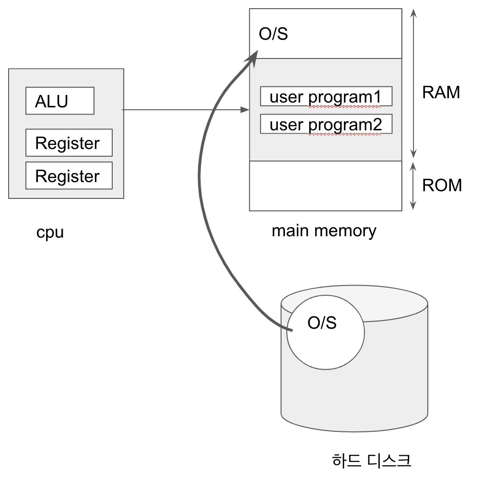
- 컴퓨터 구조: 프로세서, 메인 메모리(RAM(휘발성), ROM(비휘발성)), 하드디스크(보조메모리), POST, 부트로더
  1) 파워를 키면 프로세서는 ROM에 있는 메모리를 읽어온다. `ROM안에는 POST, 부트 로더가 저장되어 있다.`  
  2) POST(Power-On Self-Test). 내 컴퓨터가 얼마들어있고 메인메모리는 얼마들어있고 키보드, 마우스는 잘 꽂혀있는지 점검
  3) 하드디스크에 OS가 들어있다. 부트로더는 하드디스크에 있는 OS를 메인메모리로 가져온다. => 부팅 
  4) OS가 메인메모리로 올라왔으니 롬은 이제 필요없음! 즉, 파워 킬 때 한 번만 필요
  5) 바탕화면 뜬다 !! 명령 기다리는 중 
  6) ```전원을 끄기 전까지 OS는 메인메모리에 영역 항상 상주하고(resident) 있다.``` 

## 운영체제 구성(커널+셸)
1. ```커널(kernel)```, OS(프로세스)가 관리하는 부분
2. ```명령 해석(shell, command interpreter)```. 
  + 사용자로부터 명령어를 받고 명령어를 해석해 명령을 수행하는 것
  + ex) 마우스 더블클릭
  + $
  + 운영체제를 잘 안다는건 명령어(마우스)를 다룰줄 안다는 것이다.
- 애플리케이션 > 운영체제 > 하드웨어 
- OS가 다르면 애플리케이션은 실행이 안된다. 하드웨어는 같지만 운영체제가 다르기 때문에..
- OS는 자원 관리자(resource manager), 자원 할당자(resource allocator)
```
애플리케이션 : 워드, 엑셀, 게임
OS(커널 부분) : 하드웨어 자원을 관리. CPU(프로세스 관리, 젤중요1). 메모리 관리(젤중요2). 하드디스크 관리(I/O, file). 네트워크 관리. 보안 관리. ...  
H/W: 모니터, 프린터, 키보드, 마우스 ... 
```
<hr>

# 2강 운영체제 역사  
:일괄처리부터 시분할시스템까지 운영체제 변천 역사

## OS 역사
- 옛날에는 CPU가 겁나 비쌌다.
- 옛날엔 컴퓨터를 다뤄주는 operator가 있었다. 
- 1940-50년대에는 운영체제가 없었다. 
- operator 대신 일련의 과정을 일괄적으로 처리하도록 바꾸자!(```Batch Processing System```, 최초의 OS)
 + 초장기에는 메모리에 OS와 1개의 user program(컴파일러, 링커)만 가능했다.
 +I/O는 CPU가 하는 일이 아니기 때문에 CPU가 놀고 있다(idle).
- CPU가 놀고있는 상황이 많아지니 메모리에 user program을 여러개 올리자!(```Multiprogramming System```, 다중프로그래밍, 1960년대)
  + 그 전에는 I/O를 실행할때 CPU는 놀고 있었는데, 이제는 user program 2 일을 한다. 
  + CPU가 I/O를 만나면 다음 user program 으로 넘어가서 일한다.
  + 어느 순간에도 CPU가 idle 하지 않도록 ! 
  + 빠른 CPU, 느린 I/O -> 메모리에 여러 개의 job
  + 이제 여러개의 프로그램의 CPU 스케줄링, 메모리는 어떻게 관리해야할까?
- 키보드, 모니터가 생기면서 대화형(interactive system) 컴퓨터로 발전
- 컴퓨터가 비싸서 여러명서 같이 사용했는데, 일정 시간을 나눠서 CPU가 프로그램마다 일했다. ```Time-sharing system``` ex) linux(unix)
  + 동기화: 여러 프로그램이 순서가 필요
  + 가상메모리: 하드디스크의 일부를 메인메모리처럼 사용. 메인 메모리가 너무 적으니까 하드디스크의 일부를 사용하기 위해
  + 현재 우리가 대부분 사용하는 시스템. windows, mac os, android

## OS 기술 천이
- 규모별
  + 슈퍼컴퓨터 > 서버 > 워크스테이션 > PC > Handheld > Embedded(자동차, 전기밥솥, 냉장고, 세탁기)
  + no OS > Batch > Multiprogramming > Time-sharing > 대형컴퓨터 > 미니컴퓨터
<hr>

# 3강 고등운영체제, 인터럽트 기반 운영체제

## 고등 운영체제 
싱글 CPU에서 발전한 강한(성능) 컴퓨터 종류
- ```다중 프로세스 시스템(Multiprocessor system)```: n개의 CPU와 1개의 메모리
  + 한번에 많은 계산 가능. 성능향상
  + 강한 CPU 1개보다, 약한 CPU 여러개가 이득임
  + CPU 하나가 고장나도 다른 애가 일하면 됨
  + 싱글 CPU와 멀티플 CPU는 스케줄링이 다르다. 
  + 리눅스도 지원 
- ```분산 시스템(Distributed System)```
  + LAN으로 연결되어 있는 느슨한 결합
  + 하나의 일을 메세지를 주고받으며 나눠서 일함. ex) 날씨 계산 
- ```실시간 시스템(Real-time system)```
  + 정해진 시간내에 끝내야한다. 
  + 네비게이션, 공장 자동화 

## 인터럽트 기반 시스템 
- `인터럽트는 CPU에게 보내는 전기 신호로서 인터럽트가 발생하면 CPU는 하던 일을 멈추고 발생한 인터럽트를 처리하기 위해 운영체제 내부에 있는 ISR을 수행한다. 수행이 끝나면 CPU는 하던 일을 계속 진행한다. ` 
- 현대 운영체제는 인터럽트 기반 시스템! 
- 인터럽트 서비스 루틴(Interrupt Service Routine, `ISR`): 인터럽트를 발생시키면 각 하드웨어, 소프트웨어, 내부 등.. 의 인터럽트가 발생 
  * ```하드웨어 인터럽트```
    + 마우스를 움직이거나 키보드를 두들기면 인터럽트가 발생
    + 부팅 후 바탕화면에서 마우스를 움직이면 전기 신호가 발생(인터럽트), 발생된 전기 신호는 CPU에게 전달되고 CPU는 하던 일을 중지하고 OS안에 들어있는 마우스 인터럽트 코드를 읽어 해당 루틴 수행하기
    + 마우스를 더블클릭해서 hwp를 실행시키면, 하드디스크에 있는 hwp 메모리가 메인 메모리로 올라감
    + 인터럽트 결과 운영체제 내의 특정 코드 실행 (ISR)
    + ```OS는 메인메모리에 항상 상주해 있다가, 마우스나, 키보드의 인터럽트가 발생하면 인터럽트 루틴을 처리한다.``` 
  * ```소프트웨어 인터럽트```
    + add, move 등을 호출하면 운영체제에 인터럽트 걸림
    + ```유저 프로그램을 실행하다가 프린트를 사용하고 싶어 인터럽트를 걸면(소프트웨어 인터럽트) CPU는 유저 프로그램을 잠시 멈추고 OS에 프린트 인터럽트를 찾아 처리한 후 다시 유저 프로그램을 동작. 유저 프로그램을 처리하면서 이런 인터럽트 행위가 반복해서 일어날 수 있다.``` 
  * ```내부 인터럽트```
    + 내부 에러 발생 ex) 0으로 나눌 때 
    + 사용자 모드에서 관리자 모드를 실행할 때 
- 하드디스크 코드(내용)를 읽어 오는 인터럽트가 OS 내부에 있다. 
- 현재는 대부분 인터럽트 기반 운영체제 
- OS안에는 여러 루틴이 들어있다. 
<hr>

# 4강 이중모드, 하드웨어 보호

## 이중모드 (dual mode)
- 한 컴퓨터를 여러 사람이 동시에 사용할 때, 한 사람이 잘못해서 서버가 다운될 수 있다. 
- 유저가 stop 같은 명령어가 들어오면 재부팅해야하니 치명적이니 관리자만 가능하게
  + ```사용자 모드```
  + ```관리자 모드``` == ```system 모드``` == ```특권(privileged) 모드```
    * ```관리자 모드는 모든 명령어 사용 가능``` 
- CPU 레지스터에 이중 모드를 나타내는 플래그 비트를 하나 추가
  + 운영체제 서비스 실행 - 관리자 모드 
  + 사용자 프로그램 실행 - 사용자 모드
  + 하드웨어/소프트웨어 인터럽트 발생 - 관리자 모드
  + 운영체제 서비스가 끝나면 - 사용자 모드 
  + ```하나의 프로그램이 실행될 때 관리자모드, 사용자모드가 바뀌어가면서 진행된다.``` 
- 일반적인 프로그램의 실행
  + 프로그램 적재
  + 유저 모드(키보드, 마우스) > 관리자 모드(ISR) > 유저 모드(모니터, 디스크, 프린터) > 관리자 모드 > 유저 모드 .. 유저모드와 관리자 모드를 왔다갔다 거림 
- 대부분의 컴퓨터는 이중 모드를 지원한다. 
- ```일반 사용자는 절대로 OS 영역, 하드웨어 영역에 직접 접근 못한다.``` 

## 하드웨어 보호  
```직접 접근하지 말고 OS에 요청해서 접근하자```
- 입출력 장치 보호
  + 직접 입출력을 제어하면 잘못된 입출력이 나올 수 있으니 보호해야함 
    * A에 대해 출력하고 있는데 B의 내용을 출력하지 않도록..  
  + 파일 읽을 때 하드디스크에 직접 붙어서 읽지 말고 OS에 요청(소프트웨어 인터럽트). 그러면 OS가 올바른 요청인지 판단 후 제공
  + ```입출력이 필요하면 OS에 요청(소프트웨어 인터럽트)``` 
  + 사용자가 입출력 명령을 직접 내리면 ... OS가 프로그램을 강제 종료시킴
  + 즉, 입출력은 OS가 관리
- 메모리 보호
  + 우연히 또는 고의로 다른 사용자 메모리 또는 운영체제 영역 메모리에 접근한다면?  
  + ```문지기(MMU, memory Management Unit)를 두어 다른 메모리 영역 침범 감시!``` 
  + 다른 영역에 들어오려 하면 segment violation를 발생 시켜 종료 
- CPU 보호
  + 한 프로그램/사용자가 고의로 CPU 시간을 독점할 수 있으니 Timer를 두어 일정 시간 경과 시 타이머 인터럽트걸자 


# 5강 운영체제 서비스 
- 운영체제의 주요 서비스는 하드웨어 자원을 각 사용자 애ㅐ플리케이션에 적절히 분배해주는 것이다. 


## 운영체제 서비스
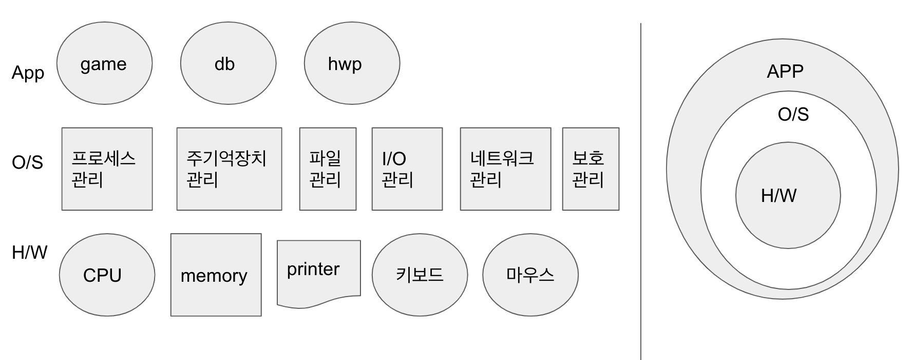

- ```프로세스 관리(process management)``` 
  + 프로세스 : 메모리에서 실행 중인 프로그램
  + 프로세스의 생성, 소멸(creation, deletion)
  + 프로세스 활동 일시 중지, 활동 재개(suspend, resume)
  + 프로세스간 통신(interprocess communication: IPC)
  + 프로세스간 동기화 (synchronization)
  + 교착상태 처리(deadlock handling)
- ```주기억장치 관리(Main memory management)```
  + 프로세스에게 메모리 공간 할당 (allocation)
  + 메모리의 어느 부분이 어느 프로세스에게 할당되었는가 추적 및 감시 
  + 프로세스 종료 및 메모리 회수 (deallocation)
  + 메모리의 효과적 사용
  + 가상 메모리: 물리적 실제 메모리보다 큰 용량 갖도록 (실제 메인메모리는 크기가 작음. 작은걸 하드디스크 처럼 크게 쓰고싶을 때)
- 파일 관리(File management)
  + Track/sector로 구성된 디스크를 파일이라는 논리적 관점으로 보게 
  + 파일의 생성과 삭제
  + 디렉토리의 생성과 삭제 
  + 기본 동작 지원: open, close, read, write, create, delete
  + Track/sector-file 간의 매핑
  + 백업(backup)
- 보조기억장치 관리(Secondary storage management)
  + 하드디스크, 플래시 메모리 등이 있음
  + 빈 공간 관리(free space management)
  + 저장공간 할당(storage allocation)
  + 디스크 스케쥴링(disk scheduling)
- 입출력 장치 관리(I/O device management)
  + 장치 드라이브
  + 입출력 장치의 성능 향상 

## 시스템 콜
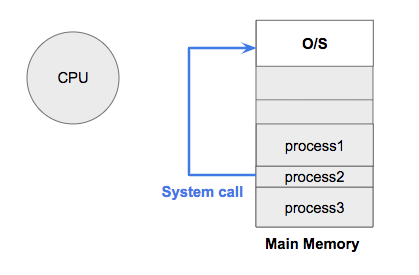
- 프로세스가 돌다가 운영체제 서비스를 받기 위한 호출
- ```일반 애플리케이션이 돌다가 OS에게 요청하는 걸 시스템 콜이라고 한다. 시스템 콜은 일반적으로 특정 레지스터에 특정 값을 준 다음, 소프트웨어 인터럽트를 걸고 OS에게 서비스를 받을 수 있다.``` 
- 파일을 만들고 싶으면 파일명, 만들고 싶다는 명령어만 입력해주면 OS가 알아서 파일 만들고, 저장위치(트랙, 섹터) 배정해줌 => OS를 서비스를 받는거임 => 시스템 콜
<hr>


# 6강 프로세스 관리
## 프로세스 
- 프로그램 vs 프로세스 (program vs process)
  + ```무덤 속 프로그램```. 하드디스크에 잠들어 있는 프로그램
  + ```살아 움직이는 프로세스```. 메모리를 할당받아 실행 중인 프로그램. (== task, job)
- 프로세스 상태 

  + new: 메인 메모리로 올라 온 상태 
  + ready: 초기화를 마치고 실행 준비 중인 상태 
  + running: 실행 상태
  + waiting: 기다리는 상태(I/O) 
  + terminated: 끝난 상태
  + 멀티 프로그래밍 시스템: new -> ready -> running -> waiting(갑자기 다른 요청이 왔을 때, I/O) -> ready -> running -> terminated
  + Time-Sharing System: new -> ready -> running -> waiting(I/O) -> ready -> running -> ready(time expired interrupt) -> running -> terminated

## PCB(Process Control Block)
- ```하나의 프로세스에 한 개의 PCB 할당```
- ```프로세스에 대한 모든 정보 있음```
  + time expired라던지 등 으로 인해 다른 프로세스로 옮기기 전에 현 프로세스의 상태를 저장해놓음 
  + process state, PC 번지 정보, registers, MMU info(base, limit), process id, list of open files  ...
- PCB는 프로세스 관리 부서 내부에 있다.!  
- 정부에서 개인 정보를 관리하는 것과 비슷하다. 정부 = 프로세스 관리 부서, PCB = 개인 정보 관리
- OS에 자료구조 형태로 들어가있음 

## Queues
각 큐에는 프로세스들이 대기하고 있음 
- ```Job Queue```
  + 하드디스크에는 수 많은 job들이 있는데, 바로 메인 메모리에 올라갈 수 없고 queue에 대기해야 한다.
  + 하드디스크 -> job queue -> 메인메모리
  + ```job scheduler```: job 중에 어떤 애를 먼저 메인메모리에 올릴까(== `Long-term scheduler`)
    * OS 안에 들어있음. 프로세스 관리부서  
- ```Ready Queue```    
  + 메인메모리 -> ready queue -> OS 서비스
  + ```CPU scheduler```: 어느 프로세스를 선택해서 OS 서비스를 해야 할까(== `Short-term scheduler`)
- ```Device Queue```
  + I/O도 queue에 줄서서 기다려야한다.
  + 하드디스크를 사용하려면 줄서라!
  + ```Device scheduler```: 어느 놈을 먼저 디스크 서비스를 받게 해줄까 
  + 메인 메모리에 CPU, I/O 작업이 존재할 때는 CPU가 놀지 않게 CPU, I/O 작업을 적절히 골라 메인에 올리기

## 멀티 프로그래밍  
- Multi-Programming은 여러 개의 프로세스가 동시에 실행 되는 것(==`Degree of multiprogramming`)
- ```medium-term scheduler```
  + 메인 메모리에 올라와 있는 프로세스 중 일정 시간 동안 사용되지 않는 프로세스를 찾아 하드디스크의 `backing store`에 swap 해놓음(swap out). 비어있는 공간에 어떤 프로세스를 가져오는 것(swap in) (OS는 메인 메모리에 있는 프로세스들을 항상 주시하고 있음)
  + 메인 메모리가 복잡할 때 어떤 걸 swapping 할까
  + swapping: 사용하지 않는.. 비어있는 프로세스 자리를 swap 해서 사용하기 
- ```context switching``` (문맥전환)
  + P1을 진행하다가 P2로 바꾸는 것 
  + ```P1의 현재 상태를 PCB1에 저장. P2의 저장된 값을 복원(restore)``` -> OS안에 Dispatcher가 이 일을 해줌
  + Context switching overhead 발생  
<hr>

# 7, 8, 9 강 CPU 스케쥴링 알고리즘
- ready queue 안에 있는 프로세스들
- Preemptive vs Non-preemptice
  + 선점 : 비선점 
    * ```선점```: 프로세스를 실행 중에 강제로 끼여들 수 있다. ex) 응급환자
    * ```비선점```: 프로세스를 실행 중에는 중간에 끼여들 수 없다. ex)  일반적인 병원
- Scheduling crieria(스케줄링 척도)
  + CPU Utilization(CPU 이용률, %). 높을수록 좋다 
  + Throughput(처리율, jobs/sec). 얼마나 처리하는가
  + Turnaround time(반환시간, sec). 작업을 끝내고 나올 때 까지 시간 
  + Waiting time(대기시간, sec). CPU 서비스를 받기 위해 얼마나 기다렸는가
  + Response time(응답시간, ). interactive system에서 중요한 척도

## CPU 스케줄링
- ```First-Come, Fist-Served``` (FCFS)
  + 특징
    * 먼저 온 고객을 먼저 서비스해주는 방식
    * 일반적으로 공평한 방법이지만 대기시간 측면에서 보면 좋은 성능은 아니다.
    * 비선점 스케줄링 
  + 문제   
    * Convoy Effect (호위효과)
    * 소요 시간이 긴 프로세스가 초반에 등장하면 효율적이지 않음

- ```Shortest-Job-First``` (SJF)
  + 특징 
    * 소요 시간이 짧은 프로세스 먼저 수행
    * 대기시간을 줄이는 방법에서는 좋은 방법임 
    * ```Nonpreemptive```, 비선점
  + 문제 
    * `starvation`

- ```Shortest-Remaining-Time-First``` (SRT)  
  + 특징
    * 수행 시간이 짧은 프로세스가 들어오면 그 프로세스를 먼저 수행
    * ```preemptive```, 선점
  + 문제 
    * `starvation` 
- ```Priority```
  + 특징 
    * 우선순위가 높은 프로세스먼저 서비스 해준다. 
    * 우선 순위는 정수로 표현
    * 작은 숫자가 우선순위가 높다
    * ```선점```: 높은 우선순위가 들어오면 해당 프로세스로 변경, ```비선점```: 더 높은 우선순위 프로세스가 도착하면 Ready queue의 head에 넣음
    * 내부 혹은 외부 요인으로 우선순위 부여
  + 문제  
    * ```starvation(기아)``` 발생 
  + 해결책  
    * `againg`. 주기적으로 조사해 우선순위 높여주기 
- ```Round-Robin``` (RR)
  + Time-sharing system 에서 많이 쓰임
  + 각 프로세스는 동일한 `Time quantum` (== time slice)을 할당받아 진행하며, 할당 시간이 끝나면 그 다음 프로세스가 선점하고 ready queue의 제일 뒤에 가서 다시 줄섬 (10 ~ 100 msec)
  + `비선점`. Preemptice scheduling
  + Perfermance depends on the size of the time quantum
    * `time quantum이 길어지면 FCFS와 같다`
    * `time quantum이 0이면 context switching overhead 발생`
- Multilevel Queue Scheduling
  + 큐를 여러 개 둬서 그룹을 나누기
  + single ready queue -> several separate queues
    * 각각의 Queue에 절대적 우선순위 존재
    * 큐가 여러 개라면 큐마다 다른 스케줄링 방식 택할 수 있다
- Multilevel Feedback Queue Scheduling
 + 여러 개의 Queue
 + q1에서 진행하다가 CPU time이 너무 길어지면 q2로 이동

## 프로세스 생성과 종료 
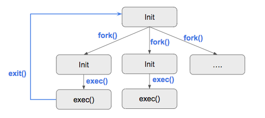
- `부팅하고 OS가 메인 메모리에 올라가면 최초 프로세스(Init)를 하나 생성한다.` 
- 프로세스는 프로세스에 의해 만들어진다.
- `트리 모양의 프로세스`(부모 프로세스, 자식 프로세스)
- Process Identifier(PID) 존재
- 프로세스 생성
  + 부모 프로세스 복사, `fork()` 
  + 실행파일을 메모리로 가져오기, `exec()`
- 프로세스 종료 
  + 해당 프로세스가 가졌던 모든 자원은 O/S에게 반환, `exit()`

## 쓰레드(Thread)
- ```프로그램 내부의 흐름, 맥```
- 보통 하나의 프로그램은 하나의 맥이 있다 
- 다중 쓰레드(Multithreads)
  + 한 프로그램에 2개 이상의 맥 
  + 맥이 빠른 시간 간격으로 스위칭 된다
  + ```concurrent vs simultaneous```
    * concurrent : 코어가 1개인 환경에서 쓰레드들이 스위칭에 의해 동시에 수행되는 거 처럼 보임
    * simultaneous : 코어가 여러개인 환경에서 쓰레드가 동시에 수행되는 것
  + ex) 동영상 플레이어, 웹브라우저, 웹프로세서
- 현재는 CPU가 1개 있을 때만 생각  

## 쓰레드 vs 프로세스 
- context switching이 프로세스 단위에서 쓰레드 단위로 내려옴
- ```스택```을 제외한 코드, 데이터 등의 메모리 공간은 공유
<hr>

# 10강 프로세스 동기화

## 프로세스 동기화
O/S는 관리 부서들의 모임인데 그 중 중요한 부서는 프로세스 관리 부서이다.
프로세스 관리 부서는 중요한 두 가지 일을 한다. 1. ```CPU 스케줄링.``` 2. ```프로세스 동기화(Synchronization)```
- Process Synchronization (== Thread synchronization)
- Processes
  + independent
  + Cooperating: 대부분
    * 다른 프로세스와 영향을 주든지, 영향을 받는지 
    * ex) 전자우편, 파일전송 
- `여러 프로세스가 공유하는 자원의 일관성을 유지해야한다.` 
- 멀티 쓰레드에서 공통 객체를 사용하면 잘못된 결과가 나올 수 있다
  + 해결
    * 한번에 한 쓰레드만 업데이트 하도록 -> ```임계구역 문제```
<hr>

# 11강 임계구역 문제 
## 임계구역 문제(Critical-Section-Problem)
- ```critical section: 멀티 쓰레드에서 쓰레드가 공통적으로 update로 사용하는 코드 부분```
  + 해결
    * `Mutual exclusion(상호배타)`: 오직 한 쓰레드만 진입할 수 있게. 다른 쓰레드가 critical section에 접근하지 못함
    * `Progress(진행)`:  critical section에 실행중인 프로세스가 없으면, 쓰레드 진입 결정은 유한 시간 내에 진행될 수 있다. 
    * `Bounded waiting(한정된 대기)`: P1 가 Critical Section 에 진입 신청 후 부터 받아들여질 때가지, 다른 프로세스들이 Critical Section 에 진입하는 횟수는 제한이 있어야 한다.

## 동기화 목적
- `우리가 진행 순서를 정할 수 있어야 한다.` 
- `원하는 결과값이 잘 나오도록 임계구역 문제를 해결해야 한다.`
- `busy wait 등과 같은 비효율성 제거`


# 12강 세마포 
## 동기화 도구
동기화 문제 해결을 위한 소프트웨어 툴 
- ```세마포어(Semaphores)```
  + 상호 배타를 하기 위해 세마포어 사용 
  + 구조
    * 정수형 변수 + 두 개의 동작(P, V)
    * P: Proveren -> acquire()
    * V: Verhogen -> release() 
  + 일반적 사용은 상호 배타   
- ```모니터``` 
  + 자바에서 주로 사용 
  + synchronized 

# 13강 생산자-소비자 문제 
## 전통적 동기화 예제
- 생산자-소비자 문제
  + 생상자가 데이터를 생상하면 소비자는 그것을 소비하는 게 생산자-소비자 문제
  + ```busy-wait``` 문제 발생
    * 생산자는 버퍼가 가득 차면 더 넣을 수 없다. => while 문으로 인해 무한대기
    * 소비자는 버퍼가 비면 뺄 수 없다. => while 문으로 인해 무한대기 
    * 무한대기 상태에서는 CPU가 다른 일을 할 수 없다. 
    * 해결법: while 대신 block이라는 세마포를 하나 더 선언하서 해결. 생산자가 버퍼에 데이터가 가득 차 넣을 수 없다면 block을 걸어놓고, 소비자가 하나 꺼낼 때 생산자를 깨워주자(호출하자). 반대로 소비자가 버퍼에 데이터가 없어서 가져올 데이터가 없으면 block을 걸어놓고, 생산자가 데이터를 삽입할 때 소비자를 깨워주자.
  + 은행 문제랑 비슷한 유형임 
  + 생산자는 버퍼에 계속 + 를 하려하고, 소비사는 버퍼에 계속 - 를 하려 한다. 이로인해 동 임계구역에 동시에 접근하게 된다. 그러면 동기화 문제를 발생하는데, 이 문제를 해결하지 않으면 코드가 실행이 안되거나 이상한 결과가 나올 수 있다. 이를 해결하기 위해 상포배타 방식인 세마포를 이용한다. 

# 14 강 기타 전통적 동기화 문제. 15강 교착상태 
## Readers-Writers Problem
- Reader와 Writer가 DB에 접근하려할 때 발생하는 문제 
- Reader는 critical section에 1개 이상 있을 수 있다. writer에 비해 읽기만 하니까 상관없다. reader가 사용 중일 때는 writer는 못들어옴  
- Writer는 update를 하므로 상호배제 해야한다.
  + 임계 구역 접근할 때 
    * R-R-R 허용
    * R-W 비허용
    * W-W 비허용
    * W-R 비허용
- 변종이 있을 수 있다.  
  + The first R/W problen(Reader한테 우선권)
  + The second R/W problem(Writer한테 우선권)
  + The Third R/W problem

## Dining Philosopher Problem  

- 식사하는 철학자 문제 
  + 원형 테이블에 5명의 철학자, 5개의 젓가락이 있다. 철학자는 생각->식사->생각->식사를  반복
  + 식사하려면 2개(왼쪽, 오른쪽)의 젓가락이 필요하다  
- 모든 철학자가 갑자기 배가고파서 다 왼쪽 젓가락을 들면```starvation``` 발생하면서 ```deadlock```에 빠짐  
- 동기화를 하다보면 간혹 deadlock에 빠짐 

## Deadlock 
왜 일어나는가? 일어나지 않게 하려면 어떻게 해야하는가? 
- 프로세스는 실행을 위해 CPU, 메모리, 파일, 프린터 등 여러 자원을 필요로 한다. 
  + OS가 이걸 잘 나눠주는 역할을 함.
  + 프로세스는 실행을 위해 여러 자원을 필요로 하는데, 어떤 자원은 갖고 있으나 다른 자원은 갖지 못할 때 대기해야함.
  + 다른 프로세스 역시 원하는 자원이 같아서 대기할 때 교착상태에 빠질 수 있다. 꼬리물기
- 모든 조건을 만족하면 교착상태가 일어날 수도 있다 
  + Mutual exclusion(상호 배타)
  + Hold and wait(보유 및 대기)
  + No Preemption(비선점)
  + Circular wait(환형대기) 
- 자원할당도 (Resource Allocation Graph)
  + 어떤 자원이 어떤 프로세스에게 할당되었는가?
  + 어떤 프로세스가 어떤 자원을 할당 받으려고 기다리고 있는가?
  + 자원: 사각형, 프로세스: 원, 할당: 화살표
- 식사하는 철학자 문제를 해결하기 위한 방법은?
  + 홀수 철학자는 왼쪽 들고, 오른쪽 들기. 짝수 철학자는 오른쪽 들고, 왼쪽 들기

## 교착상태 처리
- 교착상태 방지(Deadlock Prevention)
  + 교착상태 4가지 조건 중 한 가지 이상 불만족
  + 상호배타 
    * 자원을 공유 가능하게...프린트나, I/O 등 원천적으로 불가능할 수도 
  + 보유 및 대기   
    * 기아 발생 
  + 비선점
    * 프린트 같은 경우 비선점 불가.. 대부분 불가
  + 환형대기 
    * 자원에 번호를 부여하고, 오름차순으로 자원 요청     
  + 현실상 보유 및 대기, 환형대기만 조작해서 Deadlock 피하기
- 교착상태 회피
  + 프로세스가 자원을 요청할 때 잘못 승인을 했기 때문에 Deadlock이 발생했다고 생각 
  + 운영체제가 자원을 할당할 때 불안전하게 할당하지 않도록 해야 Deadlock을 피할 수 있다. 
- 교착상태 검출 및 복구
  + 현실적으로 Deadlock이 잘 안일어나니까 일어나도록 허용하고 주기적으로 검사하여 Deadlock 발생 시 복구
  + 검사에 따른 추가 부담 .. 오버헤드 발생 
  + 복구에 따른 메모리 부담 .. 이전 상태 기억해야함 
- 교착상태 무시 
  + 교착상태 발생 시 재시동 

# 16강 모니터
## 모니터 
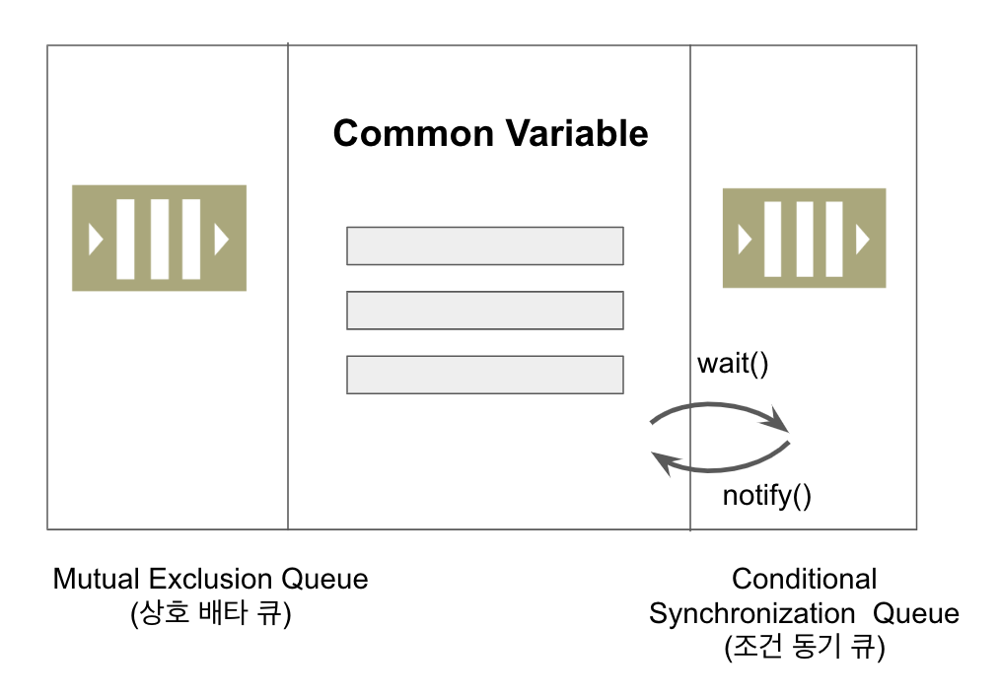
- 세마포는 오래된 동기화 기법 
- 세마포보다 고수준 개념
- 구조
  + 공유자원 + 공유자원 접근함수
  + 2개의 queues
    * ```배타 동기(Mutual exclusion)``` : commom variable에 접근할 수 있는 함수는 오직 하나만 가능. 많은 쓰레드가 있어도 오직 하나만 공통 변수에 접근할 수 있다. ```synchronized``` 키워드 사용하여 지정 
    * ```조건 동기(Conditional synchronization)``` : wait(), notify(), notifyAll() 메소드 사용 
  + 공유자원 접근함수에는 최대 1개의 쓰레드만 진입 가능하다.   
  + 진입 쓰레드가 조건 동기로 블록되면 새 쓰레드 진입 가능하다.(wait())
  + 새 쓰레드는 조건동기로 블록된 쓰레드를 꺠울 수 있다.(notify())
  + 꺠워진 쓰레드는 현재 쓰레드가 나가면 재진입할 수 있다. 
- 자바의 모든 객체는 모니터가 될 수 있다. 


# 17강 정리와 복습(1)
- CPU 스케줄링 
  + FCFS
  + SJF 
  + Priority 
    * 선점 
    * 비선점
  + RR 
- 동기화 : 임계구역 문제 해결. 원하는대로 프로세스 실행 순서 제어 
  + 세마포 
  + 모니터 

# 18강 주기억장치 관리 개요 

## 주기억장치 관리(Main Memory Management)
- 역사 
  + Core memory
  + 진공관 메모리
  + 트랜지스터 메모리 
  + 직접회로 메모리 
- 메모리는 늘어났지만 프로그램도 그만큼 증가해 메모리는 언제나 부족함 
- 기계어/어셈블리어 -> C언어 -> 자바, 객체지향 언어 
- 숫자 처리 -> 문자 처리 -> 멀티미디어 처리 -> 빅 데이터 
- 어떻게 메모리를 효과적으로 사용할 수 있을까?
  + ```메모리 낭비 없애기```
  + ```가상 메모리(virtual memory)```
- 프로그램을 메모리에 올리기
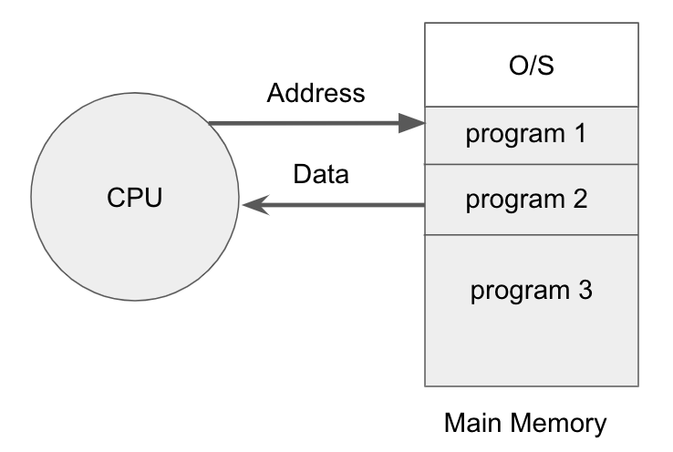  
  + 메모리 구조 
    * 주소(Address) + 데이터(Data)
  + 프로그램 빌드 과정
  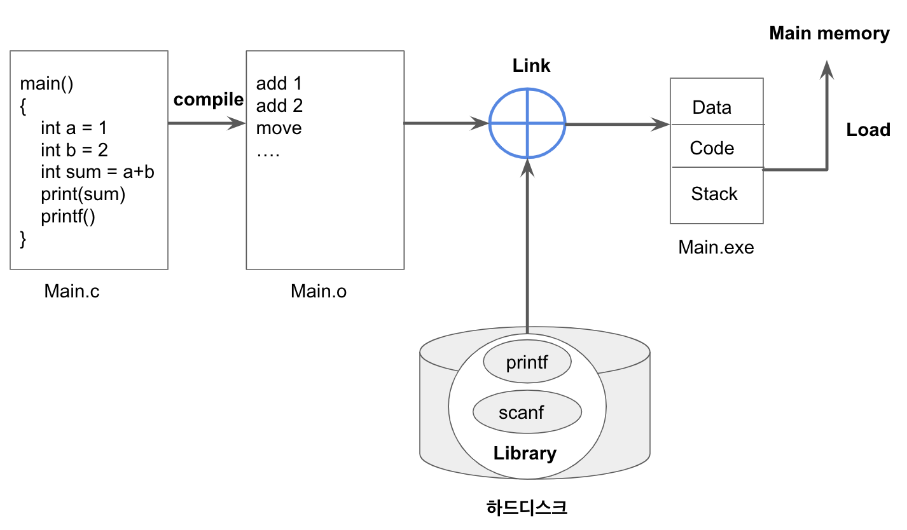
    * 원천파일(Source file): 고수준언어 또는 어셈블리언어 
    * 목적파일(Object file) : 컴파일 또는 어셈블 결과 
    * 실행파일(Excecutable file) : 링크 결과
  + 프로그램 실행: code(기계어) + data + stack 
- 실행파일을 메모리에 올리기
  + 메모리 몇 번지에?
  + 다중 프로그래밍 환경에서는?
  + MMU(Memory Management Unit) 사용
  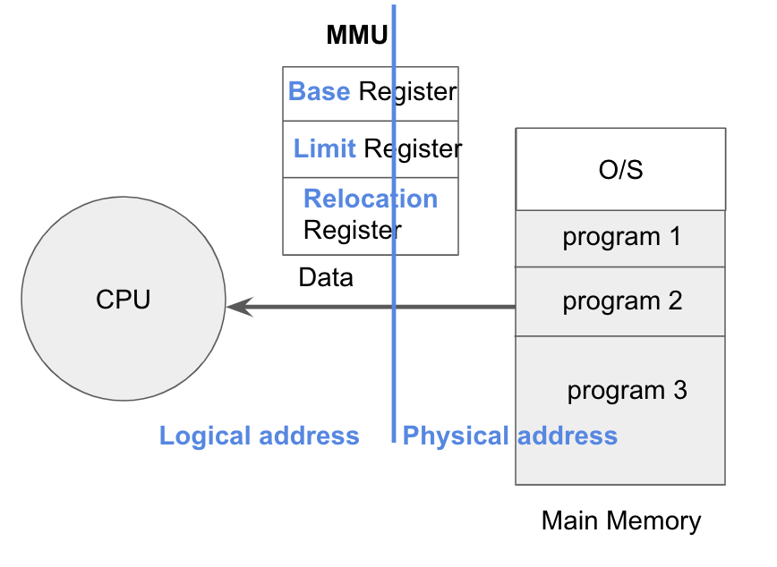
    * `메인 메모리에 할당되는 주소가 유동적이기 때문에 재배치 레지스터를 사용해 변경한다.` 
    * 재배치 레지스터를 이용하기 때문에 실제 메모리 주소 공간이 바뀌어도 CPU는 전혀 영향을 받지 않는다. 
    * `MMU는 base나 limit의 범위를 멋어나면 인터럽트가 발생하여 그 프로그램을 강제 종료시킨다.` 
    * base register, limit register, relocation register(물리주소 속이기)
  + 주소 구분  
    * 논리주소(logical address, CPU) vs 물리주소(physical address, 메인 메모리 주소)

# 19강 메모리 절약 
## 메모리 낭비 방지 
- ```동적 적재(Dynamic Loading)```
  + load: 만들어진 실행파일을 메모리에 올리는 것 
  + ```메모리 자원이 귀하니, 프로그램 실행에 반드시 필요한 루틴/데이터만 메인메모리에 적재하자 !```
    * 모든 루틴이 다 사용되는 것이 아니다.(오류처리)
    * 모든 데이터가 다 사용되는 것이 아니다(배열)
    * 실행 시 필요하면 그때 해당 부분을 메모리에 올린다. 
  + 현대가 O/S가 대부분이 사용하는 기술   
  + 모든 루틴/데이터를 적재하는 것을 정적 적재라고 한다. 
- ```동적 연결(Dynamic Linking)```
  + printf() 등 공통으로 사용되는 라이브러리를 메모리에 중복으로 올리는 것은 낭비다 
  + ```원래는 실행파일 만들 때 링크했는데(정적 연결), 로드된 다음에 링크 하기(동적 연결)``` 
  + 오직 하나의 라이브러리 루틴만 메모리에 적재하여 다른 애플리케이션 실행 시 이 루틴과 연결 
  + 리눅스는 공유 라이브러리(.so, shared library), 윈도우즈는 동적 연결 라이브러리(.dll, Dynamic Linking Library)
- ```Swapping```
  + `메모리에 적재되어 있으나 현재 사용되지 않고 있는 프로세스를 이미지형태로 만든 후, 메모리 활용도 높이기 위해 Backing store(=swap device)로 몰아내기` 
    * backing store에 몰아낸 정보는 하드디스크에 존재하는 프로그램(exe. file system)과는 전혀 다른 데이터 
    * Swap-Out: Main Memory -> Backing Store 
    * Swap-In: Backing Store -> Main Memory
  + 하드디스크 : file system + backing store 
    * backing store == main memory 비슷
  + swap-in할 때 MMU의 relocationg register로 적재 위차 바꿔주기
  + 프로세스 크기가 크면 backing store 입출력에 부담이 크다   

# 20강 연속 메모리 할당 
## 연속 메모리 할당(Contiguous Memory Allocation)
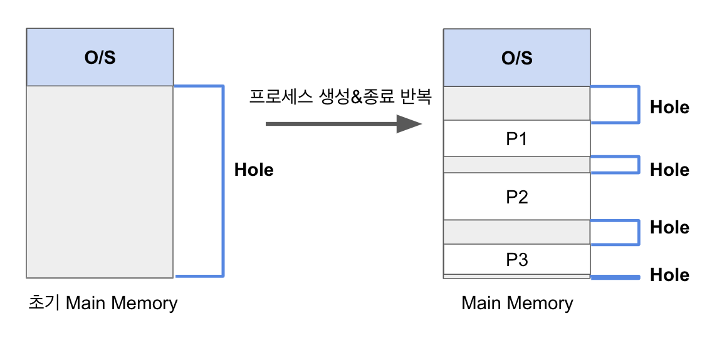
- 다중 프로그래밍 환경 
  + 부팅 직후 메모리 상태: O/S + big single hole
  + 프로세스 생성 & 종료 반복-> scattered holes
- ```메모리 단편화(Memory fragmentation)```  
  + 프로세스 생성과 종료를 반복하면 메모리 단편화 발생 
  + Hole 들이 불연속하게 흩어져 있기 때문에 프로세스 적재 불가 => ```외부 단편화(external fragmentation) 발생``` 
- 연속 메모리 할당 박식
  + First-fit(최초 적합)
    * 홀을 순차적으로 탐색했을 때 제일 먼저 발견하는 홀에 메모리에 적재 
    * 속도, 이용률 높음
  + Bast-fit(최적 적합)
    * 홀의 사이즈가 제일 비슷한 메모리에 적재  
    * 이용률 높음
  + Worst-fit(최악 적합)
    * 홀의 사이즈가 제일 큰 사이즈에 메모리를 적재   
- ```연속 메모리 할당 방식도 외부 단편화로 인한 1/3 수준으로 메모리 낭비됨```
- ```compaction``` : 흩어져 있는 hole을 한곳으로 모으면 어떨까? 
  + hole을 옮기는 오버헤드가 크고 어떻게 옮겨야 빠르게 합칠 수 있는지에 대한 최적 알고리즘이 없다. 

# 21강 페이징 
## 페이징(Paging)

- 프로세스가 연속하지 않으면 어떨까?
- ```프로세스를 일정 크기(=페이지)로 잘라서 메모리에 적재하기```
  + 메모리는 프레임의 집합
  + 프레임 크기 == 페이지 크기
- MMU안에 relocation register 갯수를 페이지 만큼 둬서 연속된 메모리 공간에 위치해있다고 CPU를 속이자! 
  + MMU는 페이지 테이블(page table)이 된다 
- `주소 변환을 통해 내부 단편화 해결`  
- 페이지 단위로 쪼갰으니 메모리에 아무곳이나 올리면 되고, 페이지 테이블에 위치를 기록해놓으면 된다. 

## 주소 변환(Address Translation)
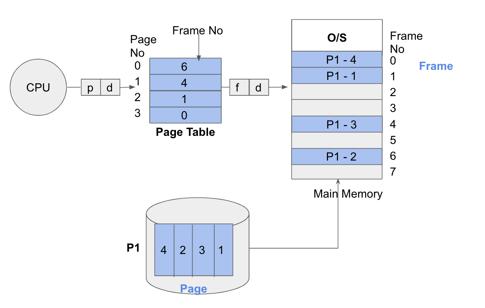
- 논리주소(Logical address) 
  + CPU logical address. p(page number), d(displacement)
- 논리주소 -> 물리주소(Physical address)
  + f(frame index), displacement) 
- 예제
  + page size = 4byte, 
  + page table :  5, 6, 1, 2
  + 논리주소 13번지는 물리주소 몇 번지?
    * 13을 2진수로 바꾸면 1101(logical address)
    * 4byte는 2^2이니, 2진수에서 뒤에 두 자리 '01' 은 d, 남은 앞자리 '11'이 p이다
    * 11은 10진수로 3이므로 page no가 3번째를 보면 값이 2(frame no)이다. 
    * 2는 2진수로 '10'이니 f는 '10'이고, d는 그대로니 '01'이다. 즉, 1001(physical address)
    * 1001는 10진수로 9이니, 9번째 프레임에 존재

## 내부단편화, 페이지 테이블 
- ```내부 단편화(internal Fragmentation)```
  + 프로세스 크기가 페이지 크기의 배수가 아니라면 프레임이 남는다 
  + 페이징을 써서 외부 단편화는 없앴지만 내부 단편화 발생
  + 외부 단편화에 비해 미미한 낭비 
- 페이지 테이블 만들기 
  + CPU 내부 레지스터
    * 장: 내부에 있기 때문에 주소 변환이 빠름 
    * 단: 테이블 크기를 크게 만들 수 없다. 
  + 메모리 
    * 장: 테이블 크기가 커도 상관없음 
    * 단: 2번 접근해야 하므로 속도가 느림 
  + TLB(Translation Look-aside Buffer)
     * 별도의 칩(SLAM)을 이용 캐시 
     * CPU 레지스터와 메모리의 중간쯤 

## 보호와 공유
- 보호(Protection)

  + 해킹 등 방지
  + 모든 주소는 페이징 테이블을 경유
  + 페이지 테이블 엔트리마다 ```r```(read), ```w```(write), ```e```(exe) 비트를 둬서 접근 제어 
  + 접근이 불가능한데 하려하면 인터럽트 발생
- 공유(Sharing)
  + 메모리 낭비 방지
  + 같은 프로그램을 쓰는 복수 개의 프로세스가 있다면, Code + data + stack에서 code는 공유 가능(단, code 내용이 바뀌지 않는다는 전제. non-self-modifying code == reentrant code == pure code)    
  + context switching이 일어나면 page table에서 code부분은 바뀌지않고 data, stack 부분만 바뀜 


# 21강 세그맨테이션
## 세그멘테이션(Segmentation)
- ```프로세스를 논리적 내용(=세그먼트)으로 잘라서 메모리에 배치 !```
  + 프로세스는 세그먼트(segment)의 집합 
  + 세그먼트의 크기는 일반적으로 같지 않다.   
- 세그먼트를 메인 메모리에 할당 
  + MMU 내의 재배치 레지스터 값을 바꿈으로써 ```CPU는 프로세스가 연속된 메모리 공간에 위치한다고 착각 !!!```
  + MMU는 세그멘트 테이블(segment table)이 된다 
  + segment는 크기가 일정하지 않기 때문에, 테이블에 limit 정보가 반드시 필요! 페이징과 다르게 2차원 배열 
  + 테이블 주소 범위를 넘어서면 인터럽트 발생
## 주소 변환
- 논리주소(Logical address) 
  + CPU logical address. s(segment number), d(displacement) 
- 논리주소 -> 물리주소(Physical address)
  + 세그먼트 테이블 내용: Base + Limit
  + limit를 넘어서면 segment violation 예외 처리 

## 보호와 공유
- 보호(Protection)
  + 모든 주소는 세크먼트 테이블을 경유한다.
  + 세그먼테 테이블 엔트리마다 r,w,x 비트 둬서 접근 제어
  + ```페이징보다 우월```
    * 페이징은 code + data + stack 영역이 있을 때 ```영역이 섞일 수 있다.```  
    * 페이징은 영역이 섞여있을 때 r,w,x 제어 하기가 어렵다. 
- 공유(Sharing)
  + 같은 프로그램을 쓰는 복수 개의 프로세스가 있다면, code는 공유 가능 
  + ```페이징보다 우월```

## 외부 단편화
- 세그먼트 크기는 고정이 아니라 가변적 
- 크기가 다른 각 세그먼트를 메모리에 두려면 동적 메모리 할당 문제가 됌 ..
- `현재는 대부분 페이징 기법을 사용`
- fist-fit, best-fit, worst-fit, compaction 등 문제 
- ```세그멘테이션 + 페이징``` 
  + 세그멘테이션은 보호와 공유면에서 효과적
  + 페이징은 외부 단편화 문제를 해결 
  + 세그먼트로 먼저 자르고, 잘린 얘를 페이징으로 자르자 => paged segmentation
  + 주소 탐색할 때마다 세그먼트 테이블 + 페이징 테이블을 거쳐야 하므로 느림 

# 22강 가상메모리 
## 가상 메모리(Virtual Memory)
- 가상 메모리 
  + 물리 메모리 크기 한계 극복 
    + 100MB 메인 메모리에서 200MB 크기의 프로세스 실행 불가 
  + 어떻게 해야할까?
    + 프로세스 이미지를 모두 메모리에 올릴 필요는 없다. 
    + ```현재 실행에 필요한 부분 메모리만 적재하자(동적 적재와 비슷한 개념)``` 
## ```요구 페이징(Demand Paging)```
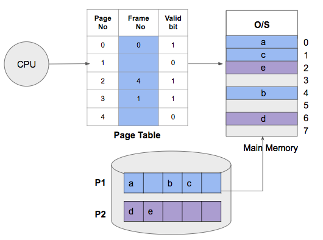
- 프로세스 이미지는 backing store에 저장 
- 프로세스는 페이지의 집합 
- 지금 필요한 페이지만 메모리에 올린다(load) (= demand 페이지만 메모리에 올린다)
- 페이지 테이블에 valid 비트를 둬서 현재 메모리에 페이지가 있는지 없는지 판단(0 없음. 1 있음)
- valid 비트가 0이면 인터럽트 신호를 발생시켜 운영체제 내부의 ISR로 점프 
## 페이지 결함(Page Fault)
<!-- 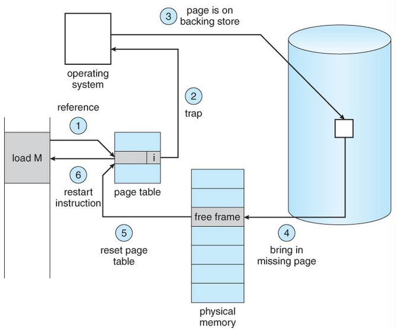 -->
- ```접근하려는 페이지가 메모리에 없다(invalid)```
- 페이지가 Memory에는 없지만 Backing store에는 존재 
- Backing store에서 해당 페이지를 가져온다.
- steps in handling a page fault 
  + 페이지 결함이 일어나면 내부적으로 어떤 일이 일어나는가?  
- pure demand paging vs prepaging
  + pure demand
    + 처음 프로그램을 실행했을 때 페이지를 아무것도 가져오지 않는다.
    + 그래서 처음부터 인터럽트 많이 발생 
    + 오래걸림 
    + 필요한 페이지만 올릴 수 있으니 메모리를 절약할 수 있음 
  - prepaging
    + 당장 필요하지 않더라도 필요할 거 같은 페이지를 미리 가져오기 
    + 미리 들고 왔으니 메모리 낭비 발생 
    + page fault는 적게 일어날 수 있으니 빠르다
- swapping vs demand paging
  + swapping
    * 단위가 전체 프로세스 단위 
  + demand paging
    * 단위가 페이지 단위     

# 23강 요구 페이징 
## 유효 접근 시간 
- page fault 시간 구하기 
## 지역성의 원리 
- Locality of reference
  + CPU가 참조하는 주소 
  + 메모리 접근은 시간적, 공간적 지역성을 가진다.
    * 컴퓨터는 보통 반복문을 사용하니, page fault가 한 번 일어나더라도 그 다음 참조는 시간, 공간이 줄어든다
  + 실제 페이지 부재 확률은 매우 낮다. 
- ```HDD(하드디스크)는 접근 시간이 너무 길다 !!```
- Backing store를 SSD 또는 느린 저가 DRAM 사용하자 

# 24강 페이지 교체 
## 페이지 교체(Page Replacement)
- Demand Paging
  + 필요한 페이지만 backing store에서 가져온다
  + 프로그램 실행이 계속됨에 따라 요구 페이지가 늘어나고, 언젠가 메모리는 가득 차게 된다. 
- Page full!!   
- ```victim page(희생양 페이지)```
  + 메모리가 가득 차면 추가로 페이지를 가져오기 위해 어떤 페이지는 backing store로 몰아내고(pasge-out) 그 빈 공간으로는 페이지를 가져온다(page-in)
  + 어떤 페이지를 몰아낼 것인가? !!! 
    * CPU에 연산이 진행된 페이지는 modify 됐으므로, 하드디스크에 write 작업을 해야하므로 시간이 오래 걸린다.
    * ```MMU에 modified bit(=dirty bit)를 둬서 기왕이면 modify 되지 않은 페이지를 victim으로 선택하자``` 
    * modify 되지 않은 비트는 write 작업 없이 그냥 쫒아내면 된다. 
  + modified bit가 0인 여러 페이지 중에서 무엇을 victim 으로?
    * Random
    * First-In First-Out(FIFO)
    * 그 외 

# 25강 페이지 교체 알고리즘 
## 페이지 교체 알고리즘
- victim을 하기 위해 어떤 애로 정할것인가 알고리즘 
- 성능 비교를 하기 전에 알아야 할 것 
- Page reference string
  + 페이지 참조 열. 페이지 단위로 참조하기 위한 단위(?) 
  + 예를들어 
  ```
    Page size = 100 byte
    CPU가 내는 주소: 100 101 102 432 612 103 104 611 612
    페이지 번호 = 1 1 1 4 6 1 1 6 6
    page reference string = 1 4 6 1 6
  ```
  + ```숫자가 연속되어서 일어나면 page fault는 일어나지 않음``` 
  + 예시의 page size가 100 byte이므로 100-199까지 페이지를 가져옴
- ```First-In First-Out(FIFO)```
  + 가장 먼저 들어온 페이지를 아웃 시킨다 
  + 예제
    * 페이지 참조열 = 7 0 1 2 0 3 0 4 2 3 0 3 2 1 2 0 1 7 0 1 
    * of frames = 3    
    * 15 page faults

|7|0|1|2|0|3|0|4|2|3|...|
|-|-|-|-|-|-|-|-|-|-|-|
|o|o|o|o|x|o|o|o|o|o|...|
|`7`|7|7|`2`|2|2|2|`4`|4|4|...|
|-|`0`|0|0|0|`3`|3|3|`2`|2|...|
|-|-|`1`|1|1|1|`0`|0|0|`0`|...|

  + Belady's Anomaly
  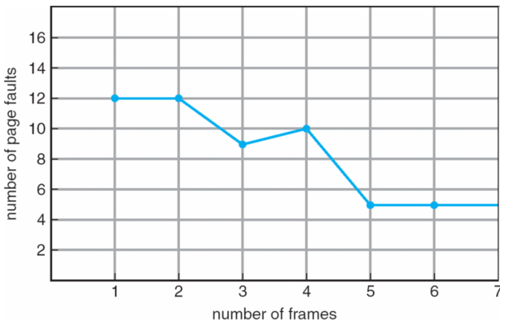
    + 프레임 수(=메모리 용량)가 증가하면 page fault가 줄어드는 것이 정상인데, 특정 부분에서는 page fault가 오히려 증가하는 이상 현상이 발생한다. 
- `Optimal`(OPT)
  + 가장 효율적인 교체 알고리즘 
  + 앞으로 page fault가 일어나지 않을 page를 택해서 victim 하자 
  + 예제
    * 페이지 참조열 = 7 0 1 2 0 3 0 4 2 3 0 3 2 1 2 0 1 7 0 1 
    * of frames = 3
    * 9 page faults

|7|0|1|2|0|3|0|4|2|3|0|...|
|-|-|-|-|-|-|-|-|-|-|-|-|
|o|o|o|o|x|o|x|o|x|x|x|...|
|`7`|7|7|`2`|2|2|2|2|2|2|2|...|
|-|`0`|0|0|0|0|0|`4`|4|4|`0`|...|
|-|-|`1`|1|1|`3`|3|3|3|3|3|...|    

  + 미래에 어떤 프로세스가 사용되는지 알 수 없기 때문에 비현실적이다 !!
- `Least-Recently-Used`(LRU)
  + 최근에 가장 적게 사용된 페이지를 victim으로 지정하자 
  + Optimal과 다르게 과거를 봄 
  + 예제 
    * 페이지 참조열 = 7 0 1 2 0 3 0 4 2 3 0 3 2 1 2 0 1 7 0 1 
    * of frames = 3
    * 12 page faults

|7|0|1|2|0|3|0|4|2|3|...|
|-|-|-|-|-|-|-|-|-|-|-|-|
|o|o|o|o|x|o|x|o|o|o|...|
|`7`|7|7|`2`|2|2|2|`4`|4|4|...|
|-|`0`|0|0|0|0|0|0|0|`3`|...|
|-|-|`1`|1|1|`3`|3|3|`2`|2|...|

  + OPT 보다는 page fault가 많이 발생하지만, FIFO보다는 적게 발생하므로 일반적으로 많이 쓰는 방법

- Global vs Local Replacement
  + Global replacement
    * 메모리 상의 모든 프로세스 페이지에 대해 교체 
  + Local Replacement
    * 메모리 상의 자기 프로세스 페이지에 대해 교체 

# 26강 프레임 할당 
## 프레임 할당(Allocation of Frames)
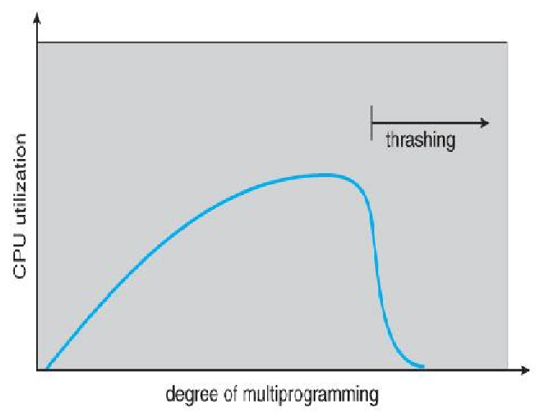
- 쓰레싱(Thrashing)
  + 프로세스 개수가 증가하면 CPU 이용률이 증가할거 같지만, 일정 범위를 넘어서면 오히려 CPU 이용률이 감소하는 현상이 나타난다. 
  + 너무 프로세스가 많아서 page in/out이 빈번하게 발생하기 때문. 즉, 메모리가 적어서 
  + 쓰레싱 극복
    * Global replacement 보다는 local replacement 
    * 프로세스당 적절한/ 충분한 수의 메모리(프레임) 할당 
## 프레임 할당    
- 정적 할당(static allocation) => 비효율적 
  + 균등 할당(equal allocation). 프로세스 마다 균등하게 프레임을 할당 
  + 비례 할당(proportional allocation). 프로세스 크기에 따라 프레임을 할당 
- 동적 할당(dynamic allocation)      
  + working set model
    * Locality vs working set 
    * Locality: 프로세스가 실행하는걸 측정해보니, 특정 시간에는 일정 범위의 페이지만 주로 참조 하는 걸 발견했다(캐시와 비슷). 이걸 봐서는 시간에 따라 지역의 범위 만큼만 프레임을 할당하면 메모리를 효율적으로 쓸 수 있을거 같다. 하지만 미래를 예측할 수 없어서 비현실적이다. 
    * working set: Locality와 달리 과거에 참조했던 페이지(working set)를 참조하여 프레임을 할당.  
  + Page-Fault Frequency(PFF)
    * Page fault 발생 비율의 상한/하한선을 지정
    * 상한선 초과 프로세스에는 더 많은 프레임 할당
    * 하한선 이하 프로세스는 프레임 회수  
  + etc  

## 페이지 크기(Page Size)
- 페이지 크기 
  + 일반적 크기: 4KB -> 4MB 
  + 크기가 점차 커지고 있음 
- 페이지 크기 영향
  + 내부 단편화: 페이지가 작은게 좋음 
  + Page-in, page-out: 페이지가 큰게 좋음 
  + 페이지 테이블 크기: 페이지가 큰게 좋음. 작아야 쌈  
  + Memory resolution(해상도): 해당 메모리에 필요한 데이터가 있을 확률. 페이지가 작은게 좋음   
  + page fault 발생 확률: 페이지 크기가 큰게 좋음. 많은 페이지를 한꺼번에 가져오자 
- 페이지 테이블 
  + 현재는 CPU 안에 TLB 칩 내장 

# 27, 28강 파일 할당 
- 컴퓨터 시스템 자원 관리 
  + CPU: `프로세스 관리`(CPU 스케줄링, 프로세스 동기화)
  + 주기억장치: `메인 메모리 관리`(페이징, 가상메모리)
  + 보조기억장치: `파일 시스템` 
- 파일이 어떻게 할당되는가? 
- 보조기억장치(하드 디스크)
  + 하드디스크: track + sector
  + sector size = 512 bytes
  + sector를 여러 개로 묶어 `블록 단위의 읽기/쓰기`(block device) <=> 키보드(character)
  + OS 설계자가 블록 크기를 얼마나 지정할건지 설계해야함 
  + 각각의 파일에 대해 free block을 어떻게 할당해줄까?
## 파일 할당(File Allocation)
- `연속 할당(Contiguous Allocation)`

  - 각 파일에 대해 디스크 상의 연속된 블록을 할당
  - 장점: 디스크 헤더의 이동 최소화 = 빠른 i/o 성능
  - 동영상, 음악, VOD 등에 적합
  - 순서적으로 읽을 수 있다(sequential access 순차접근) 
  - 특정 부분을 바로 읽을 수 있다.(direct access 직접접근). 디렉토리에 저장한 정보를 참고하여 바로 읽음 
  - 단점 
    * 파일이 삭제되면 hole 생성
    * 파일 생성/삭제 반복되면 곳곳에 흩어지는 holes
    * 새로운 파일을 어느 hole에 둘 것인가? => `외부 단편화` 발생! 
    * 외부 단편화로 인한 디스크 공간 낭비..! compaction은 시간이 오래 걸림 
    * 파일 생성 당시 이 파일의 `크기를 알 수 없다`. 
    * 파일의 크기가 `계속 증가할 수` 있다. 
- `연결 할당(Linked Allocation)`
  - 파일 디렉토리는 제일 처음 블록을 가리킨다. 
  - 각 블록은 포인터 저장을 위한 4바이트 또는 이상을 소모
  - 팡리이 커지면 다른 블록을 할당 받고 연결
  - `외부 단편화 없음!` == 디스크 낭비가 없음
  - 단점
    * 순서대로밖에 못읽음 
    * 동영상을 중간부터 못봄 .. 
    * `Direct access 불가`
    * 포인터 저장을 위해 4바이트 이상 손실
    * `낮은 신뢰성`, 포인터 끊어지면 나머지 접근 불가
    * `느린 속도`
    * 요즘은 안씀
  - `FAT 파일 시스템`으로 개선       
    * File Allocation Table 파일 시스템
    * MS-DOS, OS/2, Windows등에서 사용 
    * 포인터들만 모은 테이블(FAT)을 별도 블록에 저장
    * 별도 테이블을 둔 덕분에 `Direct access 가능`
    * FAT 손실 시 복구 위해 이중 저장 

+ `색인 할당(Indexed Allocation)` 


# 운영체제에서 잡아야 할 흐름!!!
- 운영체제에서 가장 중요한 서비스가 프로세스 관리이다. 
- 프로세스 관리 
  + CPU 스케줄링
  + 프로세스 동기화
    * critical section 문제 풀기 위해 상호배제 하기
    * 효율성 증대
      - busy-wait 하지 않기 
      - orderling 피하기 => 못피하면 deadlock에 빠짐
- 메모리 관리
  + 페이징
    + 프로세스 중 당장 필요한 부분만 메모리에 올리기 
    + 필요한 부분만 쪼개서 올리기 
      * 페이징
      * 세그먼트 
    + 프로세스가 연속하지 않아도됨. MMU 덕분에    
    + valid bit 추가 
  + 가상메모리 

의문
- time-sharing-system == RR?
- 운영체제 관점에서의 동기화, 개발에서의 동기화 